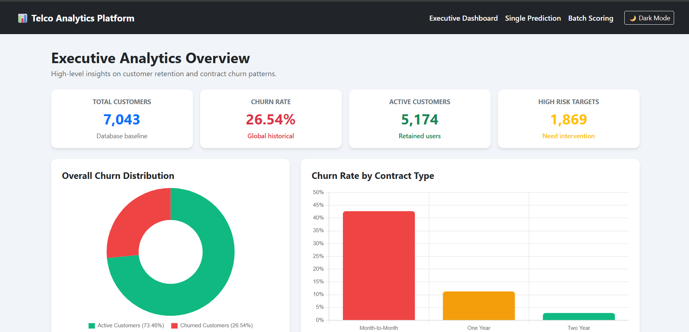
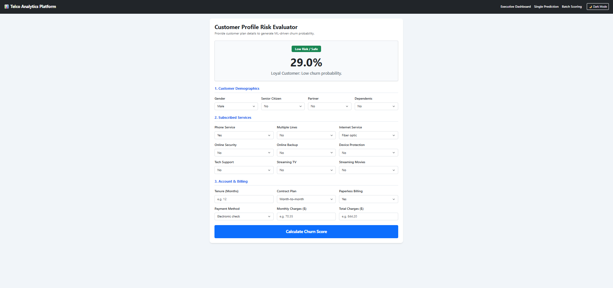
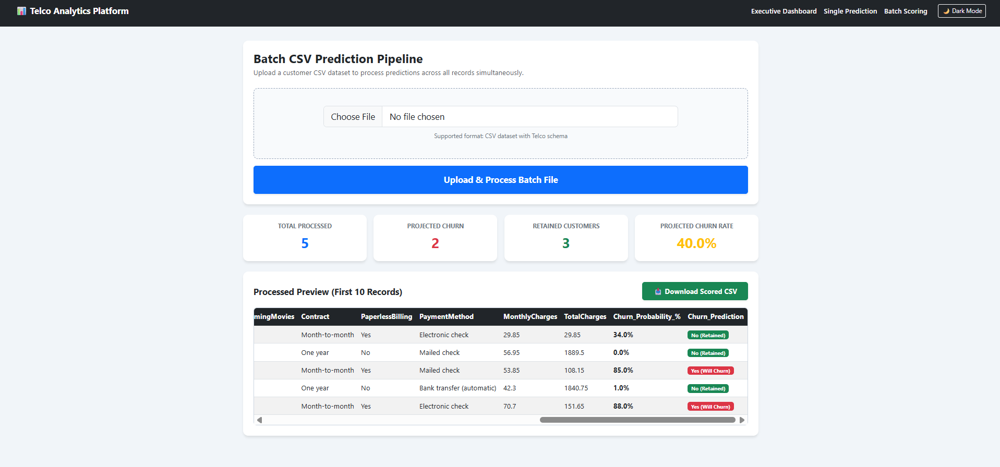

Here is the single, complete, copy-ready text for your entire `README.md` file in English:

```markdown
# 📊 Telco Customer Churn Prediction & Analytics Platform

[](https://www.python.org/)
[](https://flask.palletsprojects.com/)
[](https://scikit-learn.org/)
[](https://getbootstrap.com/)
[](https://opensource.org/licenses/MIT)

An enterprise-ready, end-to-end Machine Learning web platform engineered to predict customer churn risks for telecommunication providers. Built on the Kaggle Telco Churn dataset, this application integrates a production-tuned **Random Forest Classifier** with an interactive **Flask** web framework and modern UI visualizations.

---

## 📸 Application Interface & Workflow

### 1. Executive Analytics Dashboard
> Real-time enterprise metrics, global churn distributions via Chart.js Doughnut charts, and comparative contract risk breakdowns.



---

### 2. Single Customer Inference Pipeline
> High-precision single customer churn evaluation processing all 19 demographic, service, and billing attributes with probability score stratification.



---

### 3. High-Throughput Batch CSV Scoring Engine
> Bulk processing pipeline capable of scoring complete customer datasets simultaneously with instant preview, risk categorization, and scored CSV export.



---

## ⚡ Core Engineering Features

- **Full Feature Utilization (19/19 Features)**: Ingestion and alignment across Demographics, Subscribed Services, Account Details, and Billing features.
- **Dynamic Preprocessing Matrix**: Automated feature encoding alignment against trained binary models to eliminate schema drift during production inference.
- **Enterprise Executive Dashboard**: Interactive KPI metrics cards and asynchronous Chart.js charts (Customer Retention vs. Churn and Contract Type vs. Risk).
- **Dual Inference Paradigms**:
  - **Single Prediction**: Form-driven instant evaluation with color-coded risk alerts (Low / Moderate / High Risk).
  - **Batch Scoring Pipeline**: CSV ingestion, vectorized probability inference, dynamic summary stats, and direct attachment download for scored records.
- **Modern Responsive Design**: Dark and Light theme switching powered by CSS custom properties and localized client storage.

---

## 🔬 Machine Learning Pipeline

| Component | Technical Specification |
| :--- | :--- |
| **Model Type** | Random Forest Classifier (`sklearn.ensemble.RandomForestClassifier`) |
| **Dataset Source** | Kaggle Telco Customer Churn (7,043 Records, 21 Attributes) |
| **Target Variable** | `Churn` (Binary: Yes / No) |
| **Feature Space** | 19 Independent Predictors (Categorical One-Hot + Numeric Continuous) |
| **Serialization** | Joblib (`churn_rf_model.pkl`) with preserved feature column signatures |

---

## 📂 Project Architecture

```text
Telco-Churn-Flask-App/
│
├── app.py                     # Flask application routes, preprocessing & inference logic
├── churn_rf_model.pkl         # Trained Random Forest serialized binary
├── requirements.txt           # Project environment dependencies
├── .gitignore                 # Tracked file exclusions
├── README.md                  # Comprehensive platform documentation
│
├── screenshots/               # Interface UI captures
│   ├── dashboard.png          # Executive dashboard preview
│   ├── predict.png            # Single prediction interface preview
│   └── batch.png              # Batch scoring pipeline preview
│
└── templates/
    ├── dashboard.html         # Executive analytics dashboard view
    ├── predict.html           # Single prediction form & outcome cards
    └── batch.html             # Batch CSV upload, tabular preview & metrics

```

---

## 🛠️ Technology Stack

* **Backend**: Python 3.10+, Flask
* **Machine Learning & Data Processing**: Scikit-Learn, Pandas, NumPy, Scipy, Joblib
* **Frontend & Visualizations**: HTML5, CSS3, JavaScript (ES6+), Bootstrap 5, Chart.js

---

## ⚙️ Installation & Local Setup

### Prerequisites

* Python 3.10 or higher
* Git

### 1. Clone the Repository

```bash
git clone [https://github.com/akashvidunitha2005-apple/Telco-Churn-Flask-App.git](https://github.com/akashvidunitha2005-apple/Telco-Churn-Flask-App.git)
cd Telco-Churn-Flask-App

```

### 2. Virtual Environment Configuration

```bash
# Windows
python -m venv venv
venv\Scripts\activate

# macOS / Linux
python3 -m venv venv
source venv/bin/activate

```

### 3. Install Dependencies

```bash
pip install -r requirements.txt

```

### 4. Launch the Application

```bash
python app.py

```

Navigate to `http://127.0.0.1:5000/` in your browser.

---

## 📊 Pipeline Endpoints

* **`/` (GET)**: Executive Dashboard with KPI cards and aggregate Chart.js analytical charts.
* **`/predict` (GET / POST)**: Single customer inference form with dynamic risk stratification.
* **`/batch` (GET / POST)**: Ingestion pipeline for Telco dataset CSV files with batch scoring.
* **`/download_batch` (GET)**: Stream-buffered download of the batch scored CSV dataset.

---

## 📄 License

This project is released under the [MIT License](https://www.google.com/search?q=LICENSE).

```

